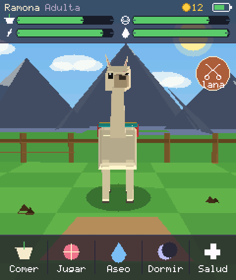
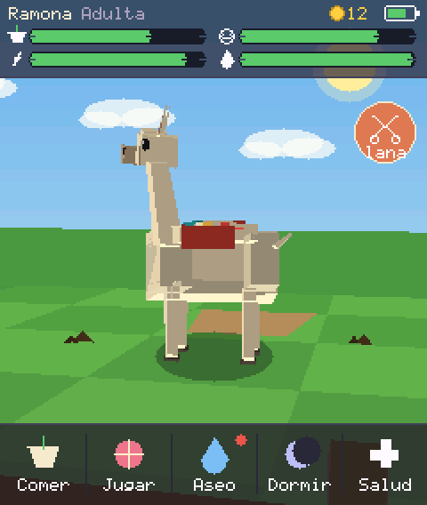
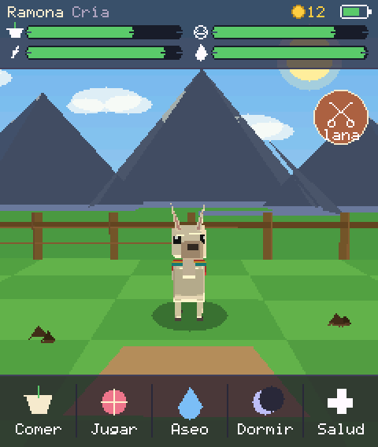
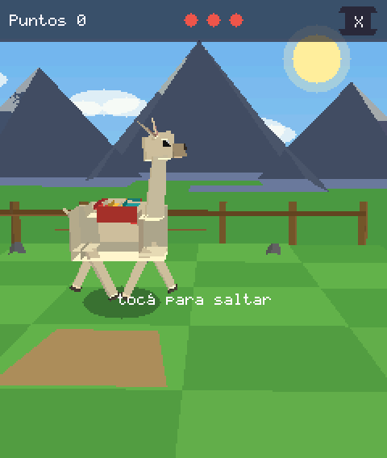
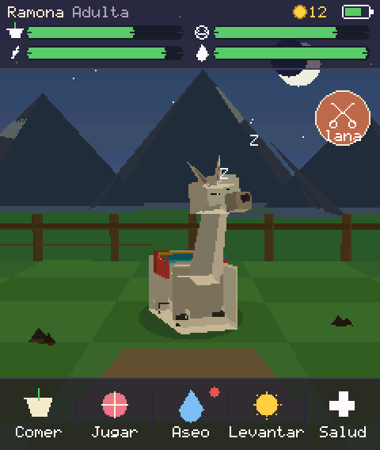
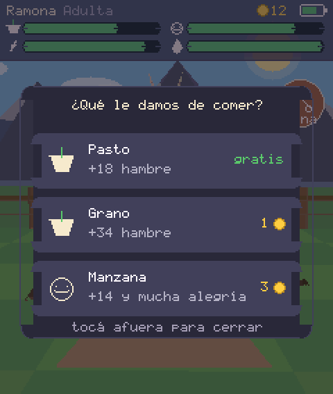

# Mi Llama — mascota virtual 3D para ESP32-S3-Touch-LCD-1.83

Un Tamagotchi con una llama modelada en 3D, renderizada en tiempo real por
software sobre la pantalla táctil de 1.83" (240 × 284) de la placa Waveshare
**ESP32-S3-Touch-LCD-1.83** (SKU 32790). Sin LVGL, sin sprites: hay un motor 3D
propio con z-buffer que dibuja la llama poligonal, el corral y la cordillera.

| Corral | Modelo 3D | Cría |
|---|---|---|
|  |  |  |

| Minijuego | Noche | Comida |
|---|---|---|
|  |  |  |

Todas las capturas salen del simulador de escritorio, que corre exactamente el
mismo código que la placa.

## Qué hace

- **Llama 3D animada**: camina, come, salta, duerme en postura *kush*, se
  enferma, parpadea, mueve las orejas y **escupe** si la querés sobrealimentar.
- **Necesidades reales**: hambre, ánimo, energía, higiene y salud bajan con el
  tiempo, incluso con el equipo apagado (se recupera con el RTC al encender).
- **Ciclo de vida**: cría → joven → adulta → anciana. Cambian el tamaño, las
  proporciones (la cría tiene la cabeza más grande) y el color de la lana.
- **Economía**: la lana crece sola; cuando llega al 60 % aparece el botón de
  esquila y te deja monedas para comprar grano, manzanas o remedios.
- **Minijuego "Salto de la llama"**: la llama corre y hay que tocar la pantalla
  para saltar las piedras. Los puntos dan monedas y suben el ánimo.
- **Sensores**: sacudir la placa hace saltar a la llama (o la despierta), la
  inclinación mueve suavemente la cámara y el arrastre con el dedo la orbita.
- **Día y noche** según el reloj RTC: cielo, estrellas, luna y luces cambian.
- **Ahorro de energía**: baja el brillo a los 25 s sin uso y entra en sueño
  profundo a los 3 min; se despierta al tocar la pantalla.

## Hardware

Placa: **Waveshare ESP32-S3-Touch-LCD-1.83** (ESP32-S3R8, 8 MB PSRAM, 16 MB
flash). El detalle completo de pines está en [`docs/hardware.md`](docs/hardware.md).

| Bloque | Chip | Conexión |
|---|---|---|
| Pantalla | ST7789, 240 × 284 IPS | SPI: DC 4, CS 5, SCK 6, MOSI 7, RST 38, BL 40 |
| Táctil | CST816T | I2C 0x15, RST 39, INT 13 |
| IMU | QMI8658 (6 ejes) | I2C 0x6B |
| RTC | PCF85063 | I2C 0x51 |
| Energía | AXP2101 | I2C 0x34 |

El bus I2C es compartido: **SDA 15, SCL 14**.

## Compilar y grabar

Requiere ESP-IDF 5.5 o superior.

```bash
idf.py set-target esp32s3
idf.py build
idf.py -p /dev/ttyACM0 flash monitor
```

La partición `factory` es de 4 MB y la partida se guarda en NVS, así que
sobrevive a reinicios y a regrabaciones del firmware (mientras no borres NVS).

## Probarlo en la computadora

El motor, el juego y la interfaz son C portable sin dependencias del ESP-IDF, así
que se puede correr en cualquier PC y sacar capturas:

```bash
cd sim
make            # compila build/llamasim
make png        # genera capturas PNG de todas las pantallas en build/shots
./build/llamasim build/shots minigame   # una escena puntual
```

Escenas disponibles: `boot`, `main`, `turn`, `food`, `stats`, `minigame`,
`sleep`, `sick`, `dead`, `cria`, `night`, `shake`.

## Cómo está armado

```
components/g3d/          motor 3D + dibujo 2D (portable, sin ESP-IDF)
  include/g3d.h            matemática, mallas, rasterizador con z-buffer
  include/g2d.h            primitivas 2D, fuente 5x7 con acentos y ñ
components/llamapet/     el juego (portable)
  src/pet.c                simulación de necesidades y ciclo de vida
  src/llama_model.c        geometría low-poly y animaciones de la llama
  src/llama_scene.c        corral, cerco, cordillera y objetos
  src/game.c               bucle, cámara, gestos, partículas
  src/ui.c                 HUD, botones, menús
  src/minigame.c           minijuego de saltos
main/                    firmware ESP32-S3 (drivers + bucle principal)
sim/                     simulador de escritorio
docs/                    documentación y capturas
```

La única frontera con el hardware es
[`llama_platform.h`](components/llamapet/include/llama_platform.h): hora, guardado,
sonido y semilla aleatoria. El ESP32 la implementa con RTC + NVS; el simulador,
con memoria y un reloj falso.

Más detalle: [`docs/motor3d.md`](docs/motor3d.md) (cómo funciona el
rasterizador) y [`docs/mecanicas.md`](docs/mecanicas.md) (números del juego).

## Rendimiento y memoria

- Framebuffer RGB565: 240 × 284 × 2 = **133 KB** en PSRAM.
- Z-buffer (float, guarda 1/w): **266 KB** en PSRAM.
- Buffers DMA de volcado: 2 × 19 KB en RAM interna.
- Geometría típica por cuadro: ~450 triángulos (llama ~230, escenario ~220).
- El bucle principal se limita a ~30 fps a propósito, para cuidar la batería.
- Medición de referencia: **0.62 ms por cuadro** (lógica + render completo) en
  x86-64 con `-O2`. El ESP32-S3 es bastante más lento; el número de la placa
  todavía no está medido (ver limitaciones).

## Limitaciones conocidas

- **Sonido sin implementar.** La placa lleva ES8311 + ES7210, pero los pines de
  audio sólo están publicados dentro del BSP oficial de Waveshare. `llama_plat_tone()`
  queda como enganche listo en `main/platform_esp32.c` en lugar de adivinar el
  cableado; el juego ya llama a esa función en todos los eventos.
- El driver del **AXP2101** es mínimo (porcentaje de batería y estado de carga).
- **El firmware no está probado sobre la placa física** (no tengo una acá), así
  que los fps reales y el ajuste fino de la pantalla (inversión de color,
  orientación del táctil) hay que confirmarlos al grabarla. Lo que sí está
  verificado es el juego completo: 40 000 cuadros con entrada aleatoria bajo
  AddressSanitizer y UndefinedBehaviorSanitizer, sin fugas ni errores, más una
  revisión visual de todas las pantallas. Los pines salen del repositorio
  oficial de la placa, no de suposiciones.

## Créditos de arte

El diseño de la llama se guió por una referencia generada con Higgsfield (imagen
y malla GLB); ver [`docs/assets.md`](docs/assets.md). La geometría que corre en
la placa está modelada a mano con primitivas para entrar en el presupuesto de
triángulos del ESP32-S3.
